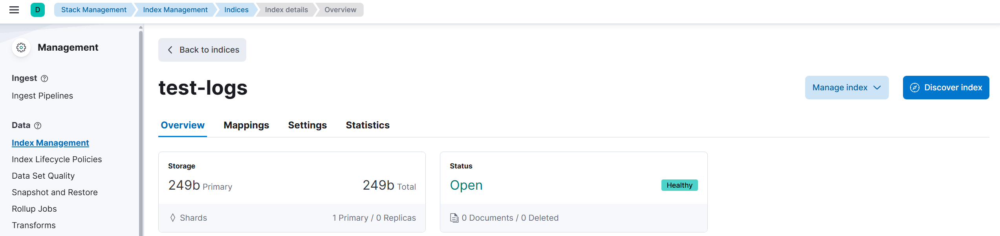
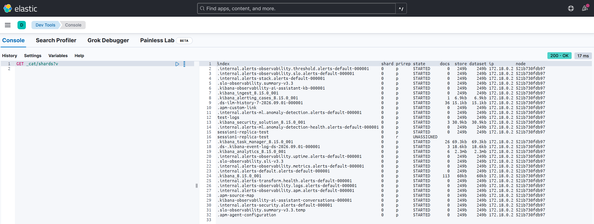

# Session 1 — Cluster fundamentals

## TL;DR

Stood up a single-node Elasticsearch + Kibana cluster with Docker Compose and checked its health, then watched a plain index go yellow the moment it wanted a replica with nowhere to live. That yellow status turned out to be the shard allocator's placement rule showing up live, not a misconfiguration — confirmed by deliberately triggering it again on a second index and watching `_cat/shards` show an `UNASSIGNED` replica row with every placement column blank.

## Architecture: cluster → node → index → shard

```
Cluster "docker-cluster"
   │
   └── Node (1 JVM process, this dev setup)
         │
         ├── Index: test-logs
         │     └── Shard 0 (primary)   ← self-contained Lucene index
         │           ✕ replica blocked — can't share its primary's node
         │
         └── Index: session1-replica-test
               ├── Shard 0 (primary)   ← STARTED, assigned to the node
               └── Shard 0 (replica)   ← UNASSIGNED, no other node to go to
```

A shard, not an index, is the actual unit Elasticsearch distributes across nodes. Every index is split into shards the moment it's created — primary, and optionally replica.

## Walkthrough

### Building blocks: document, index, node, cluster, shard

Elasticsearch's core vocabulary maps onto familiar database terms, with a few important breaks from the analogy.

A **document** is one record — a single JSON object. Same idea as a row in a SQL table, or a document in MongoDB. Unlike a SQL row, it has no fixed schema unless one is explicitly defined — that's the mapping, covered in session 2.

An **index** is a named collection of documents that share a mapping. Same idea as a table, or a Mongo collection. The analogy breaks down at the storage layer: a SQL table is one physical structure, but an index is never stored as a single blob. It's always split into shards from the moment it's created.

A **node** is one running Elasticsearch process — one JVM. It stores data and serves requests. Nothing exotic — just a server process that happens to speak the Elasticsearch protocol.

A **cluster** is one or more nodes working together as one logical system, sharing cluster state — which indices exist, which shards live where, and so on. A single-node setup is technically "a cluster of one," which is why a fresh single-node deployment still reports a `cluster_name` and has cluster-level health.

A **shard** is what an index actually gets split into, and shards — not indices — are the unit Elasticsearch distributes across nodes. Each one is a self-contained Lucene index under the hood, and each comes in two roles:

- **Primary** — holds the authoritative copy of a slice of the index's documents.
- **Replica** — a live copy of a primary, kept for fault tolerance and to spread out read load. Not a periodic snapshot — every write applies to the replica as part of the same indexing operation, so it never falls behind the way an async read-replica would.

**Bottom line:** think "table" for index and "row" for document to get oriented fast, but remember the storage-layer break — an index is a distributed thing made of shards from day one, a table isn't.

### Standing up the cluster with Docker Compose

A single-node Elasticsearch + Kibana stack needs a handful of explicit settings to behave correctly for local dev, rather than fighting defaults built for a multi-node production cluster.

**Hands-on:** wrote [`/docker-compose.yaml`](/docker-compose.yaml). Key settings and why each is there:

- `discovery.type=single-node` — normally, nodes discover each other and elect a master via quorum vote. With one node that process doesn't apply, so this tells Elasticsearch to self-elect as master immediately instead of waiting for peers that will never show up.
- `xpack.security.enabled=false` — disables auth/TLS between client and Elasticsearch. A deliberate dev-only shortcut, called out explicitly rather than left implicit — a real deployment needs this on (a stretch-goal task in the curriculum revisits it).
- `ES_JAVA_OPTS=-Xms512m -Xmx512m` — an explicit, fixed JVM heap size instead of letting Elasticsearch auto-size it. Matches this project's "config explicit over defaulted" convention, and leaves RAM for the OS page cache — see the Redis comparison below for why that matters.
- A named volume for the Elasticsearch data directory, so `docker compose down` doesn't wipe the index.

Logged into Kibana at [http://localhost:5601/](http://localhost:5601/) and used Dev Tools (Management → Dev Tools) — a console built into Kibana for sending raw HTTP requests to Elasticsearch, the same way `curl` would, just with syntax highlighting and history.

Ran `GET _cluster/health` before creating anything: `status: green`, `active_primary_shards: 28`. Those 28 shards existed before any user index did — Kibana's own internal system indices, covered in [Questions I Had](#questions-i-had) below.

**Bottom line:** a fresh cluster is never actually empty. Kibana bootstraps its own metadata indices the instant it connects, so `active_primary_shards: 0` is not the baseline to expect.

### Replica placement: a hard allocator rule, not a preference

A replica shard is never allowed to live on the same node as its primary. Elasticsearch's shard allocator enforces this unconditionally, no exceptions.

The reasoning is pure fault tolerance: a replica exists so the data survives if the node holding the primary dies. A replica sitting on the same node as its primary would die with it — zero protection — so the allocator refuses to place one there at all.

Consequence for a single-node cluster: a normal index, created with its defaults (1 replica), will always have that replica stuck **unassigned**, because there's no second node to host it. Cluster health reports **yellow**, not green — not broken, just not redundant.

**Hands-on:** created a plain index with no explicit settings:

```
PUT test-logs
```

returned:

```json
{
  "acknowledged": true,
  "shards_acknowledged": true,
  "index": "test-logs"
}
```

`GET _cluster/health` right after:

```json
{
  "cluster_name": "docker-cluster",
  "status": "yellow",
  "timed_out": false,
  "number_of_nodes": 1,
  "number_of_data_nodes": 1,
  "active_primary_shards": 29,
  "active_shards": 29,
  "relocating_shards": 0,
  "initializing_shards": 0,
  "unassigned_shards": 1,
  "delayed_unassigned_shards": 0,
  "number_of_pending_tasks": 0,
  "number_of_in_flight_fetch": 0,
  "task_max_waiting_in_queue_millis": 0,
  "active_shards_percent_as_number": 96.66666666666667
}
```

`status: yellow`, `active_primary_shards: 29`, `unassigned_shards: 1` — the replica-placement rule showing up live. `test-logs` was created with Elasticsearch's default `number_of_replicas: 1`, and that replica had nowhere valid to go. Yellow here means "healthy but not redundant," not broken — the primary shard stayed active the whole time, so the index was fully readable and writable throughout.

Fix applied:

```
PUT test-logs/_settings
{
  "number_of_replicas": 0
}
```

After that, `GET _cluster/health` returned `status: green`, `unassigned_shards: 0`. This is a dev-only fix, worth treating as a deliberate, documented "no redundancy" choice for local development, not a default to carry into anything real.

That change is possible on a live index with zero downtime because `number_of_replicas` is a **dynamic** setting — changing it just tells Elasticsearch to stop wanting a copy it can't place, or to start wanting more. Contrast with `number_of_shards`, which is fixed permanently at index-creation time, because it determines the hash routing (`hash(document_id) % number_of_primary_shards`) that decides which primary shard owns each document. Changing that after the fact would mean physically relocating every document in the index.

Inspected the result in Kibana's UI (Menu → Stack Management → Index Management → `test-logs`): 1 primary shard, 0 replicas, 0 docs — matching the Dev Tools output exactly. The UI is just a view over the same cluster state, not a separate source of truth.

<div align="center">
  
</div>

**Bottom line:** yellow on a fresh single-node cluster almost always means "an index wants a replica it can't place," not "something is wrong." Setting `number_of_replicas: 0` is the standard single-node dev fix, but it's a real trade-off — zero redundancy — not a free lunch.

### How writes and reads get routed

There's no separate "orchestrator" process. Any node can act as the coordinating node for a given request — whichever node the client happens to talk to plays that role for that one request.

Writes and reads route differently:

```
Write for document id="42"
        │
        ▼
hash("42") % number_of_primary_shards
        │
        ▼
   always the same primary shard
        │
        ▼
 primary applies the write, then
 forwards it to its replica(s) —
 not acknowledged until replicas
 are in sync
```

Which primary shard owns a given document is deterministic — `hash(document_id) % number_of_primary_shards`. Every write for a specific document ID always lands on the same primary shard, which processes it and forwards the write to its replicas. Because a document is always owned by exactly one primary, two primaries can never race over the same document — that's how Elasticsearch avoids needing a traditional lock manager. The trade-off for that simplicity: no cross-document transactions.

Reads work differently — the coordinating node can serve a request from any copy of the relevant shard, primary or replica, typically round-robin. That's the actual point of having replicas: spreading out query load, not just safety.

One place a common analogy breaks: AWS RDS read replicas replicate asynchronously and can lag behind the primary. Elasticsearch doesn't work that way — a write isn't considered acknowledged until it's been applied to all in-sync replicas too, so replicas stay in lockstep with the primary instead of trailing it.

On a larger cluster, nodes can specialize — dedicated data nodes, master-eligible nodes that manage cluster state, coordinating-only nodes that just route traffic. On this single-node dev cluster, every one of those roles collapses onto the one node.

**Bottom line:** write routing is deterministic and lock-free by design; read routing is about load distribution, not correctness — either replica gives the same answer since they're kept in lockstep.

### Why Elasticsearch isn't "Redis for search"

Elasticsearch is not an in-memory store like Redis. Redis requires its entire dataset to fit in RAM. Elasticsearch's data lives on disk in Lucene segment files and is never required to fit in memory.

Speed comes from two separate mechanisms, not from keeping everything resident in RAM:

1. The **inverted index** — a lookup table mapping each term to the documents containing it — is an algorithmically better structure for text search than a linear scan, true even with zero caching involved. Think of it like a book's index in the back: you don't scan every page for a word, you jump straight to the pages listed.
2. The OS **page cache** does most of the "feels like memory" work. Elasticsearch deliberately caps its JVM heap small — commonly around 50% of available RAM — precisely so the rest of RAM is left free for the operating system to cache the Lucene segment files being read from disk. Some structures, like the term dictionary, are also memory-mapped directly.

So it's closer to "a disk-backed index that's very well cached by the OS" than "an in-memory store." Durability is also stronger by default than a plain in-memory store: every write goes through a write-ahead log — the **translog** — covering the window between the write and the next periodic flush to disk, so a crash between flushes doesn't lose acknowledged writes.

**Bottom line:** Elasticsearch's speed is architectural (inverted index) and OS-assisted (page cache), not a promise that your dataset fits in RAM the way Redis requires.

### Watching the allocator refuse a placement, live

**Hands-on:** ran `GET _cat/shards?v` to see shard allocation directly, rather than through `_cluster/health`'s aggregate counts. `_cat/shards` lists one row per shard: which index it belongs to, `prirep` (`p` for primary, `r` for replica), its state, doc count, size, and which node it's assigned to. For `test-logs` this returned exactly one row — `p`, `STARTED`, assigned to the single node — and no `r` row at all, since `number_of_replicas` had already been set to `0` on that index earlier. No replica wanted, none shown.

<div align="center">
  
</div>

To see the allocator actually refuse a placement rather than just reason about it, created a second index that explicitly asks for a replica:

```
PUT session1-replica-test
{
  "settings": {
    "number_of_replicas": 1
  }
}
```

`1` is also Elasticsearch's out-of-the-box default for a plain `PUT <index>` with no settings block — writing it explicitly here just makes the intent visible instead of relying on an implicit default.

`GET _cluster/health` right after came back `status: yellow`, `active_primary_shards: 30`, `unassigned_shards: 1` — one more primary than before (the new index's own primary, which allocated fine), and exactly one shard the allocator can't place, matching the replica it was just asked for.

`GET _cat/shards?v&index=session1-replica-test` made that concrete at the row level:

```
index                  shard prirep state      docs store dataset ip         node
session1-replica-test 0     p      STARTED       0  227b    227b 172.18.0.2 521b730fdb97
session1-replica-test 0     r      UNASSIGNED
```

The `p` row looks like any other started shard — assigned to the node, with a real IP and node name. The `r` row is `UNASSIGNED` with every placement column blank: no IP, no node. That blank is the allocator's refusal made visible — it evaluated the "never place a replica on the same node as its primary" rule and left the replica homeless rather than break it. This is the exact situation `test-logs` would have been in if its replica count had been left at the default `1` instead of explicitly zeroed out.

Cleaned up with `DELETE session1-replica-test` — it existed only to trigger this demonstration, not as project state to carry forward.

**Bottom line:** an `UNASSIGNED` row with blank placement columns is the allocator working correctly, not a stuck or broken shard — it's refusing to violate the fault-tolerance rule, not failing to find a spot.

## Questions I Had

**Where did the original 28 shards come from?**
`GET _cat/indices?v` and `GET _cat/shards?v` show what they actually were: indices named `.kibana_8.15.0_001`, `.kibana_task_manager_8.15.0_001`, `.internal.alerts-*`, `.apm-agent-configuration`, `.slo-observability.*`, and similar — all created by Kibana the moment it first connected to the empty cluster and initialized itself. Kibana isn't a separate database with its own storage — it's itself just another Elasticsearch client. All of its application state (dashboards, saved searches, alerting rules, background task scheduling, ILM history, per-feature config for APM/ML/security/observability/SLO, even for features never touched) is stored as ordinary documents in ordinary Elasticsearch indices. 

Two conventions showed up in that output: a leading dot (`.kibana...`, `.internal...`) marks a system index — internal plumbing, hidden from normal index listings and excluded from wildcard patterns like `GET */_search` by default. And every one of them has `rep` (replicas) = 0, which is why the cluster started green rather than yellow before anything was touched — Elasticsearch deliberately defaults these low-stakes, easily-regenerated system indices to zero replicas, unlike the `number_of_replicas: 1` a plain user-created index like `test-logs` gets.

**How is Elasticsearch replication different from something like an AWS RDS read replica?**
RDS read replicas replicate asynchronously and can lag behind the primary by some interval. Elasticsearch doesn't work that way — a write isn't considered acknowledged until it's been applied to all in-sync replicas too, so replicas stay in lockstep with the primary rather than trailing it.

**If `number_of_replicas` is set to 0, does adding a second node to the cluster later automatically give the index a replica?**
No. `number_of_replicas: 0` means "this index is configured to want zero replicas," not "no replica exists yet." Adding a second node wouldn't retroactively cause a replica for `test-logs` to appear on its own — only explicitly raising `number_of_replicas` again would make Elasticsearch start placing one.

**Why can `number_of_replicas` change on a live index with zero downtime, but `number_of_shards` can't change at all?**
`number_of_replicas` is a dynamic setting — changing it just tells Elasticsearch to stop (or start) wanting extra copies. `number_of_shards` is fixed permanently at index-creation time because it determines the hash routing (`hash(document_id) % number_of_primary_shards`) that decides which primary shard owns each document. Changing it after the fact would mean physically relocating every document in the index.
